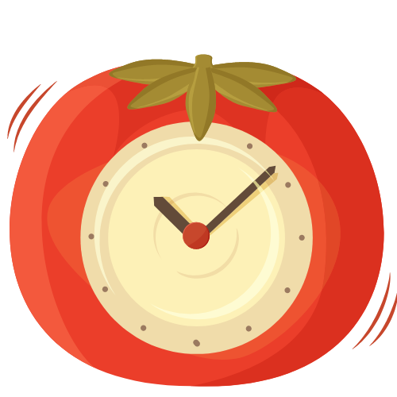

<p align="center">
  <a href="http://pomo-timer-theta.vercel.app/">
    
  </a>
</p>

<h1 align="center">PomoTimer</h1>

<p align="center">
  
  
  
</p>


<div align="center">
  
</div>

<h3 align="center">Stay Productive. Stay Fit.</h3>

## 💡 Motivation and Overview

Since a past couple of months I was so preoccupied with my college life that I was finding it hard to take out time for my fitness. Hence, came the idea for this project. A productivity app that helps you stay fit.
<br><br>**PomoTimer is a simple and configurable Pomodoro timer that provides a reliable way to track productivity using the Pomodoro Technique along with providing you customised exercise videos at the end of each work cycle.**

## ✨ Features

- **Beautiful UI**. The app has a minimalistic and intuitive UI making it pleasing to the eyes and easy to use.
- **Customizable rules**. You can easily modify the default rules of Pomodoro Principle to be fitted on your personal needs and likings.
- **Sound Notifications**. If enbaled, the app will notify you when a session completes. Useful when you are away from your computer while taking some break.
- **Customized Exercise Recommendations**. If enabled, the app will provide you customised exercise videos based on your preferences at every long break.
- **Open-Source**. PomoTimer is an open-source project. Feel free to create pull requestes for any new features or updates.🌱

## 👩‍💻 Technologies Used

**ReactJS, Tailwind CSS, DaisyUI, Youtube API, NodeJS, Vercel**

## 👩‍🔧 Installation and Setup

Before setting up the project make sure the LTS (Long Term Support) version of NodeJS is installed.
1. Fork the [PomoTimer repository](https://github.com/khush2706/PomoTimer).
2. Clone the repository:
  ```sh
  git clone git@github.com:<USERNAME>/PomoTimer.git && cd pomotimer
  ```
  Replace the `<USERNAME>` with your GitHub username. If you've already forked the repo, you'll want to ensure your fork is configured and that it's up to date. This will save you the headache of potential merge conflicts. To configure your fork:
  ```sh
  git remote add upstream https://github.com/khush2706/PomoTimer.git
  ```
  To sync your fork with the latest changes:
  ```sh
  git checkout main
  git fetch upstream
  git merge upstream/main
  ```
3. Install the project:
  ```sh
  npm install
  ```
4. Start the project:
  ```sh
  npm start
  ```
  
  ## 💭 Future Scope
  
  - **Website Blocker**. Enable user to block specific website while working in order to stay on focus.
  - **Time extender**. Enable user to extend timer if needed. Useful when the user wants to finish the task first before taking up a break.
  - **Tasks database**. Enable user to save completed tasks into a database. Useful when the user wants to monitor or track previews tasks.
  - **Productivity report**. Provide some useful summary about user's productivity to have some sense of accomplishments.

## License

MIT &copy; [Khushboo Chaturvedi](https://github.com/khush2706)
    
  
